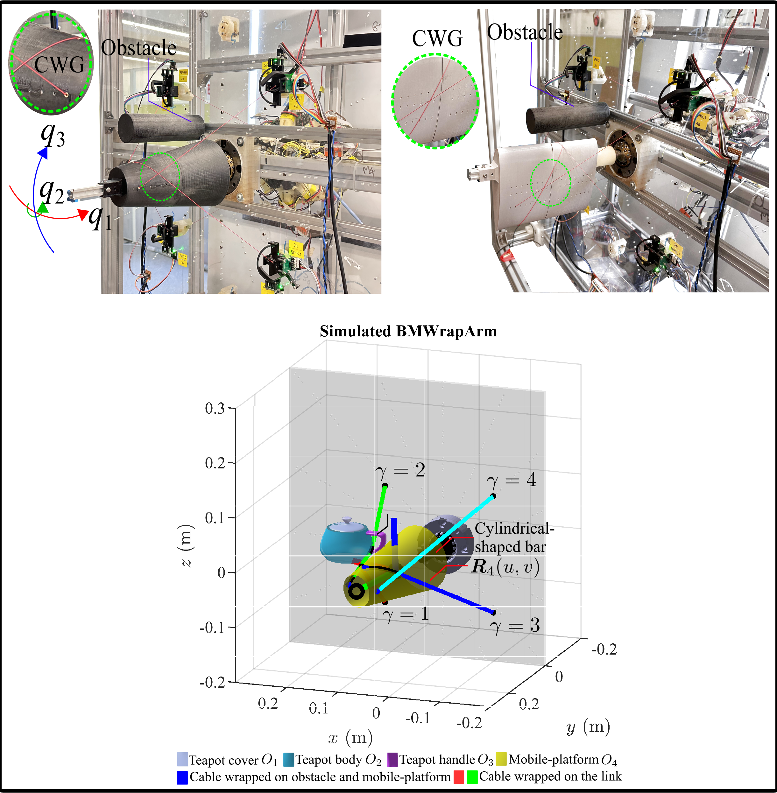

# Kinematic and Dynamic Modeling of Cable-Object Interference and Wrapping in Complex Geometrical-Shaped Cable-Driven Parallel Robots

[Paper Link](https://www.techrxiv.org/users/788558/articles/1022587-kinematic-and-dynamic-modeling-of-cable-object-interference-and-wrapping-in-complex-geometrical-shaped-cable-driven-parallel-robots?commit=e9d8729cd98fbe81834277ab3036be6ab67a983c)

## Multimedia

### Application Preview


### Full Video
Click [here](https://drive.google.com/file/d/1wv_-YRMZ-RpaE7pxipY27WhJc2ZteXAT/view?usp=sharing) to view the full video.

## Installation

### Steps to Set Up the Repository

1. **Clone the repository**:
    ```bash
    git clone https://github.com/bhattner143/GeoWrapSim-CDPR.git
    ```

2. **Add the folder to MATLAB**:
    Open MATLAB, navigate to the downloaded folder, and add it to the MATLAB path.

3. **Initialize the CASPR environment**:
    Run the `initialise_CASPR.m` script to configure the Cable-Driven Parallel Robot Simulator (CASPR) environment.

### About CASPR
CASPR is a simulation framework for modeling and analyzing cable-driven parallel robots. It provides tools for kinematic and dynamic analysis, enabling researchers and engineers to study complex cable-driven systems effectively.

### Tutorials for CASPR

Explore the tutorial scripts in the `scripts/CASPR_tutorials` folder. These `.mlx` scripts provide step-by-step guidance on using CASPR for various applications, including kinematic and dynamic analysis of cable-driven parallel robots. Open these scripts in MATLAB to follow the tutorials interactively.

### Note on Tutorials

The tutorial scripts in the `scripts/CASPR_tutorials` folder are untested due to modifications in the repository. If you encounter issues, refer to the original CASPR repository for tutorials at [CASPR GitHub Repository](https://github.com/darwinlau/CASPR).

You can also explore the CASPR tutorial series on YouTube for step-by-step guidance:  
[CASPR YouTube Playlist](https://www.youtube.com/watch?v=b_24t_j1uQo&list=PLZCfv3Lre4aVbsS8zFYlg2x-kPuB-rrRC)

## Model

### NURBS Teapot Model
The `.mat` files for the NURBS teapot model are located in the `data/nurbs_related` directory.

### BMWrapArm Model
The BMWrapArm model configuration files are available in the `data/model_config/models/MCDM/BMWrapArm` directory. Key files include:

1. **BMWrapArm_bodies.xml**  
    - Initial joint pose  
    - Center of mass and its location  
    - Inertial matrix  

2. **BMWrapArm_cables.xml**  
    - Cable locations and attachment points  

3. **BMWrapArm_operational_spaces.xml**  
    - Operational spaces information  

4. **BMWrapArm_trajectories.xml**  
    - Trajectory details  

### Note on Other Robots
Other robot models are available in the `data/model_config/models/SCDM`, `data/model_config/models/MCDM`, and `data/model_config/models/HCDM` directories. However, wrapping models have not been implemented for these robots.

## Running the Scripts

Simulation scripts are located in `/scripts/cable_wrapping/Simulations/`. Key scripts include:

1. **Inverse Kinematics Simulation**  
    Run `script_BMWrapArm_IK_cone_big_obs_nurbs_mul_obj_wrap.m` for inverse kinematics simulation with a teapot obstacle and cone-frustum mobile platform.

2. **Inverse Dynamics Simulation**  
    Run `script_BMWrapArm_ID_friction_cone_big_obs_nurbs_mul_obj_wrap.m` for inverse dynamics simulation with a friction obstacle and cone-frustum mobile platform.

3. **Other Simulations**  
    Additional scripts such as `script_BMWrapArm_geodesic_model_IK_almond.m` and `script_BMWrapArm_geodesic_model_IK_cone_big_obstacle_torus.m` are available for simulations with almond-shaped mobile platforms and cylinder obstacles, or cone-frustum mobile platforms and torus obstacles. These scripts may require debugging to function correctly.

## Code Overview

### Geodesic Equations
**Class File:** `/model/nurbs/NURBSGeodesic.m`  
This class implements the geodesic equations, including Christoffel symbols, numerical solutions, metric tensors, and geometrical properties. It contains all foundational mathematics and equations related to geodesics discussed in Section 3.2 of the paper.

### BMWrapArm Model Configuration
**Class File:** `/data/model_config/models/WrappingBezierGeodesicModelConfig.m`  
This class defines the BMWrapArm model, including bodies and cables. Note that the cables are discontinuous and not optimized in this class.

### Cable Object Detection and Optimization
**Class File:** `/scripts/cable_wrapping/Simulations/MultipleCableObjectWrapping/CWOptWithGenIntDetBezier.m`  
This class implements the cable object detection algorithm (Algorithm 1) and performs optimization for cable wrapping geodesics for a static pose in multi-object cable wrapping scenarios, as discussed in Section 3.3 of the paper.

### Single Object Cable Wrapping Optimization
**Class File:** `/model/optimizer/CableWrappingOptimizerBezier.m`  
This class handles numerical optimization for cable wrapping geodesics for a static pose in single-object cable wrapping scenarios, as detailed in Section 3.3 of the paper.

### Graphical Simulator
**Class File:** `/CASPR/src/Simulation/CableWrappingMotionSimulatorBase.m`  
This class provides a graphical simulation environment for cable wrapping motion.

### Inverse Kinematics (IK) Models
1. **Class File:** `/model/inverse_kinematics/CableWrappingGeodesicIKSimulatorBezier.m`  
    Implements the inverse kinematics (IK) model based on geodesics, as described in Section 5 of the paper.

2. **Class File:** `/model/inverse_kinematics/CableWrappingInverseKinematicsSimulator.m`  
    Implements an older version of the inverse kinematics (IK) model, as described in Section 5 of the paper.

### Inverse Dynamics Solver
**Class File:** `/src/Analysis/InverseDynamics/Solvers/CableWrappingIDSolverQuadProgBezier.m`  
This class implements a quadratic programming-based inverse dynamics solver for cable-driven parallel robots, supporting multiple solver backends and linear constraints.

### Inverse Dynamics Simulator
**Class File:** `/model/inverse_dynamics/CableWrappingInverseDynamicsSimulatorBezier.m`  
Implements the inverse cable wrapping dynamics simulator with the friction model discussed in Section 6 of the paper.

### Friction Model
**Class File:** `/model/friction/BiarcInterpolation/CWGFrictionModelBezierSurfs.m`  
Implements the friction model discussed in Section 6 of the paper.

## Citation

Cite as:  
Dipankar Bhattacharya, T K Cheung, Yaxiang Wang, et al. Kinematic and Dynamic Modeling of Cable-Object Interference and Wrapping in Complex Geometrical-Shaped Cable-Driven Parallel Robots. TechRxiv. June 04, 2024.  
DOI: 10.36227/techrxiv.171746934.49156915/v1

@article{bhattacharyakinematic,
  title={Kinematic and Dynamic Modeling of Cable-Object Interference and Wrapping in Complex Geometrical-Shaped Cable-Driven Parallel Robots},
  author={Bhattacharya, Dipankar and Cheung, TK and Wang, Yaxiang and Lau, Darwin}
}